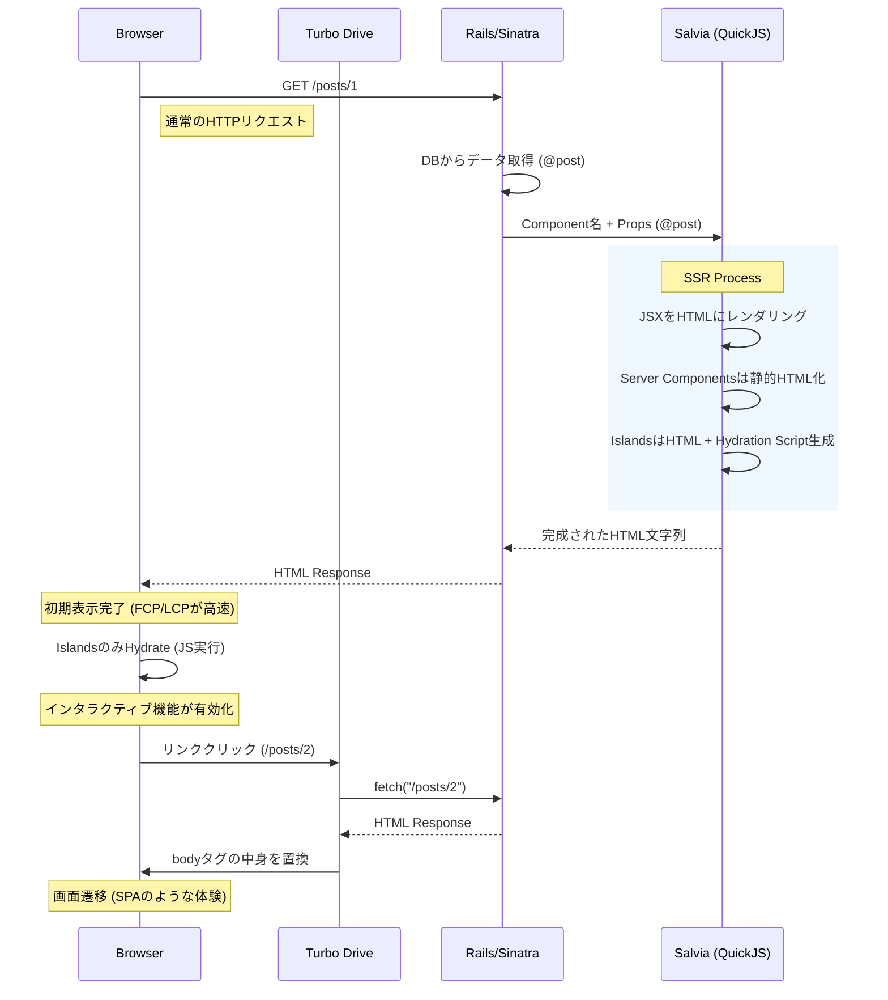

# Wisdom for Salvia: The True HTML First Architecture

Salvia は、Ruby の堅牢なバックエンドと、モダンなフロントエンド（JSX/TSX）の表現力を融合させた、新しい「HTML First」アーキテクチャを提案します。
これは単なる SSR エンジンではなく、Web アプリケーション開発における「View 層の再定義」です。

---

## 1. Core Concepts & Architecture

### The "True HTML First" Flow

Salvia のアーキテクチャは、**「サーバーで完成された HTML を返し、必要な部分だけをクライアントで活性化する」** という哲学に基づいています。



---

## 2. Detailed Comparisons

### vs Next.js (Node.js Backend / BFF)

Next.js は素晴らしいフレームワークですが、Rubyist にとっては「別の言語・別のサーバー」を管理するコストが発生します。

| 特徴 | Next.js (App Router) | Salvia (on Ruby) |
| :--- | :--- | :--- |
| **主要言語** | TypeScript / JavaScript | **Ruby** (Backend) + TSX (View) |
| **インフラ** | Node.js サーバーが必要 | **既存の Ruby サーバー** (Puma/Unicorn) 内で完結 |
| **データ取得** | API (REST/GraphQL) or Server Actions | **Ruby メソッド呼び出し** (ActiveRecord 等) |
| **状態管理** | Client Component 間で複雑になりがち | **URL ベース** (Turbo Drive) + 局所的な State |
| **ビルド** | Webpack/Turbopack (複雑) | **esbuild** (Deno経由で高速・シンプル) |

**Salvia の勝ち筋**:
Ruby のエコシステム（ActiveRecord, RSpec, Sidekiq）をそのまま使いながら、View だけをモダンにできます。「API を作る手間」がゼロになります。

### vs Rails + React (SPA / API Mode)

Rails を API モードにして、フロントエンドを React SPA で作る構成です。

| 特徴 | Rails API + React SPA | Salvia |
| :--- | :--- | :--- |
| **初期表示** | 遅い (JS バンドルロード -> API フェッチ -> レンダリング) | **爆速** (サーバーから HTML が即座に返る) |
| **SEO** | 弱い (クローラー対策が必要) | **最強** (完全な HTML が返る) |
| **開発フロー** | Rails API 定義 -> React 型定義 -> fetch 実装 | **Controller で Props を渡すだけ** |
| **認証** | JWT / Cookie 管理が複雑 | **Rails の Session / Devise** がそのまま使える |

**Salvia の勝ち筋**:
「ローディングスピナー」を見せる必要がありません。データは最初からそこにあります。

---

## 3. Deep Dive: Key Technologies

### A. JSX View & ERBless (ERB からの脱却)

ERB は強力ですが、複雑な UI を作ると「ヘルパー地獄」や「jQuery との格闘」になりがちです。JSX は「UI を関数として合成する」ための最高の構文です。

**Old Way (ERB):**
```erb
<!-- app/views/posts/show.html.erb -->
<div class="post">
  <h1><%= @post.title %></h1>
  <%= render partial: "comments/list", locals: { comments: @post.comments } %>
  <!-- JSで動くボタンを作るために data 属性や script タグが必要... -->
  <button onclick="alert('Like!')">Like</button>
</div>
```

**Salvia Way (JSX):**
```tsx
// app/components/PostDetail.tsx
export default function PostDetail({ post }: { post: Post }) {
  return (
    <div class="post">
      <h1 class="text-2xl font-bold">{post.title}</h1>
      {/* コンポーネントとして自然にネスト可能 */}
      <CommentList comments={post.comments} />
      
      {/* インタラクティブな部分は Island として分離 */}
      <LikeButton postId={post.id} />
    </div>
  );
}
```
*   **型安全性**: `post.title` が存在するか、型定義で保証されます。
*   **コンポーネント化**: `CommentList` や `LikeButton` を import して使うだけ。

### B. JSON API-less (No More "API Glue")

Salvia では、データを JSON にシリアライズして API エンドポイントを作る必要がありません。

**Old Way (React SPA):**
1.  Rails: `render json: @post` (Serializer 定義)
2.  React: `useEffect(() => fetch('/api/posts/1')...)`
3.  React: `if (loading) return <Spinner />`
4.  React: `<div>{data.title}</div>`

**Salvia Way:**
1.  Rails: `render_island "PostDetail", props: { post: @post }`
2.  Salvia: HTML 生成
3.  Browser: 表示完了

**「API の糊付けコード (Glue Code)」が消滅します。**

### C. Server Components vs Islands

Salvia はデフォルトで **Server Components** です。つまり、クライアントに JS を送りません。

*   **Server Components (`app/components/`)**:
    *   静的な表示（ヘッダー、フッター、記事本文、リスト表示）。
    *   クライアントサイドの JS サイズは **0 bytes**。
    *   `useState` や `useEffect` は使えません（サーバーで1回実行されるだけ）。

*   **Islands (`app/islands/`)**:
    *   動的な部分（いいねボタン、ドロップダウン、カルーセル）。
    *   この部分だけがクライアントで Hydrate されます。
    *   `useState` や `onClick` が使えます。

**例: 記事ページ**
```tsx
export default function ArticlePage({ article }) {
  return (
    <Layout>
      {/* Server Component: 静的HTMLのみ。JSなし。高速。 */}
      <ArticleContent body={article.body} />
      
      {/* Island: ここだけJSがロードされ、動的に動く */}
      <CommentSection articleId={article.id} />
    </Layout>
  );
}
```

### D. Turbo Drive Integration

Salvia が生成した HTML は、Turbo Drive によって SPA のように遷移します。

1.  ユーザーがリンクをクリック。
2.  Turbo が `fetch` で次のページの HTML を取得。
3.  現在の `<body>` を新しい HTML で置換。
4.  `<head>` 内のスクリプト（Islands のバンドルなど）をマージ。

これにより、**「React Router などのクライアントサイドルーター」が不要** になります。ルーティングは全て Rails/Sinatra 側（`config/routes.rb`）で管理します。

---

### E. Why "use server" is Unnecessary

Next.js などのフレームワークでは、クライアントコンポーネントからサーバー側の関数を直接呼び出すために **Server Actions (`"use server"`)** という機能があります。これは実質的に RPC (Remote Procedure Call) です。

**Salvia では、この概念は不要（または既に存在している）です。**

1.  **"Action" は標準の Controller:**
    Salvia は Rails/Sinatra の上に構築されているため、最強の "Server Action" システムである **HTTP Controller** が既に存在します。
2.  **HTML Form こそが RPC:**
    JS の関数をボタンに紐付ける代わりに、標準的な HTML フォームを使います。
    ```tsx
    // Salvia View (JSX)
    <form action="/posts" method="post">
      <input name="title" class="border" />
      <button type="submit">Create</button>
    </form>
    ```
3.  **No Magic:**
    送信ボタンを押すと、標準の POST リクエストが `PostsController#create` に飛びます。Rails が DB を更新し、リダイレクトまたは再レンダリングを行います。Turbo Drive がその遷移を滑らかに処理します。
4.  **責務の分離:**
    ロジックは Ruby (Controller/Model) に、表示は JSX (View) に。UI コンポーネントの中にデータベース操作ロジックを混ぜる必要はありません。

---

## 4. Conclusion: The "Salvia" Experience

Salvia は、**「Ruby で開発する楽しさ」** を損なうことなく、**「現代的なフロントエンドの UX」** を手に入れるための武器です。

*   **Rubyist にとって**: 慣れ親しんだ Controller と Model がそのまま使えます。View だけが強力になります。
*   **Frontend Engineer にとって**: 好きな JSX/TSX と Tailwind CSS で UI を構築できます。API 待ちの時間がなくなります。
*   **User にとって**: ページが爆速で表示され、サクサク動きます。

**"Write Ruby, Render JSX, Deliver HTML."**
これが Salvia の真髄です。
