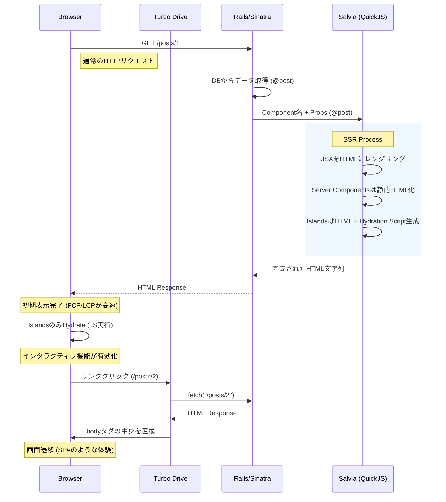

# Wisdom for Salvia: The True HTML First Architecture

Salvia は、Ruby の堅牢なバックエンドと、モダンなフロントエンド（JSX/TSX）の表現力を融合させた、新しい「HTML First」アーキテクチャを提案します。
これは単なる SSR エンジンではなく、Web アプリケーション開発における「View 層の再定義」です。

---

## 1. Core Concepts & Architecture

### The "True HTML First" Flow

Salvia のアーキテクチャは、**「サーバーで完成された HTML を返し、必要な部分だけをクライアントで活性化する」** という哲学に基づいています。



---

## 2. Directory Structure & Architecture

Salvia は、Rails や Sinatra の既存の `app/` ディレクトリ構造に統合されるように設計されています。

```
my_rails_app/
├── app/
│   ├── controllers/      # Rails Controllers
│   ├── models/           # Rails Models
│   ├── views/            # Rails Views (ERB)
│   │
│   ├── islands/          # 🏝️ Interactive Components (Preact)
│   │   └── Counter.jsx   # クライアントサイドで Hydrate される
│   │
│   ├── pages/            # 📄 Server Components (Preact)
│   │   └── Home.jsx      # サーバーサイドでのみレンダリング (JSなし)
│   │
│   └── components/       # 🧩 Shared Components
│       └── Button.jsx    # islands や pages から import して使う
│
├── public/
│   └── assets/
│       └── islands/      # ビルドされたクライアント用 JS がここに出力される
│
├── salvia/               # ⚙️ Salvia Configuration
│   ├── build.ts          # ビルドスクリプト
│   └── deno.json         # Deno 設定 (Import Map)
│
└── config/
    └── initializers/
        └── salvia.rb     # Salvia 設定
```

### ポイント
*   **`app/islands`**: ここに置いたコンポーネントは、サーバーで HTML になり、ブラウザで JavaScript として Hydrate されます（`island` ヘルパーを使用）。
*   **`app/pages`**: ここに置いたコンポーネントは、サーバーで HTML になるだけです。JavaScript はブラウザに送信されません（**Server Components**）。
*   **`salvia/`**: ビルド設定や Deno の設定ファイルが置かれます。アプリケーションコードはここには置きません。

### Import Map (`salvia/deno.json`)
`salvia/deno.json` でライブラリのバージョン管理を行います。

```json
{
  "imports": {
    "preact": "https://esm.sh/preact@10.19.2",
    "@/": "../app/"  // app/ ディレクトリへのエイリアス
  }
}
```

これにより、コンポーネント内で `import Button from "@/components/Button";` のように書くことができます。

---

## 3. Detailed Comparisons

### vs Next.js (Node.js Backend / BFF)

Next.js は素晴らしいフレームワークですが、Rubyist にとっては「別の言語・別のサーバー」を管理するコストが発生します。

| 特徴 | Next.js (App Router) | Salvia (on Ruby) |
| :--- | :--- | :--- |
| **主要言語** | TypeScript / JavaScript | **Ruby** (Backend) + TSX (View) |
| **インフラ** | Node.js サーバーが必要 | **既存の Ruby サーバー** (Puma/Unicorn) 内で完結 |
| **データ取得** | API (REST/GraphQL) or Server Actions | **Ruby メソッド呼び出し** (ActiveRecord 等) |
| **状態管理** | Client Component 間で複雑になりがち | **URL ベース** (Turbo Drive) + 局所的な State |
| **ビルド** | Webpack/Turbopack (複雑) | **esbuild** (Deno経由で高速・シンプル) |

**Salvia の勝ち筋**:
Ruby のエコシステム（ActiveRecord, RSpec, Sidekiq）をそのまま使いながら、View だけをモダンにできます。「API を作る手間」がゼロになります。

### vs Rails + React (SPA / API Mode)

Rails を API モードにして、フロントエンドを React SPA で作る構成です。

| 特徴 | Rails API + React SPA | Salvia |
| :--- | :--- | :--- |
| **初期表示** | 遅い (JS バンドルロード -> API フェッチ -> レンダリング) | **爆速** (サーバーから HTML が即座に返る) |
| **SEO** | 弱い (クローラー対策が必要) | **最強** (完全な HTML が返る) |
| **開発フロー** | Rails API 定義 -> React 型定義 -> fetch 実装 | **Controller で Props を渡すだけ** |
| **認証** | JWT / Cookie 管理が複雑 | **Rails の Session / Devise** がそのまま使える |

**Salvia の勝ち筋**:
「ローディングスピナー」を見せる必要がありません。データは最初からそこにあります。

---

## 4. Deep Dive: Key Technologies

### A. JSX View & ERBless (ERB からの脱却)

ERB は強力ですが、複雑な UI を作ると「ヘルパー地獄」や「jQuery との格闘」になりがちです。JSX は「UI を関数として合成する」ための最高の構文です。

**Old Way (ERB):**
```erb
<!-- app/views/posts/show.html.erb -->
<div class="post">
  <h1><%= @post.title %></h1>
  <%= render partial: "comments/list", locals: { comments: @post.comments } %>
  <!-- JSで動くボタンを作るために data 属性や script タグが必要... -->
  <button onclick="alert('Like!')">Like</button>
</div>
```

**Salvia Way (JSX):**
```tsx
// app/components/PostDetail.tsx
export default function PostDetail({ post }: { post: Post }) {
  return (
    <div class="post">
      <h1 class="text-2xl font-bold">{post.title}</h1>
      {/* コンポーネントとして自然にネスト可能 */}
      <CommentList comments={post.comments} />
      
      {/* インタラクティブな部分は Island として分離 */}
      <LikeButton postId={post.id} />
    </div>
  );
}
```
*   **型安全性**: `post.title` が存在するか、型定義で保証されます。
*   **コンポーネント化**: `CommentList` や `LikeButton` を import して使うだけ。

### B. JSON API-less (No More "API Glue")

Salvia では、データを JSON にシリアライズして API エンドポイントを作る必要がありません。

**Old Way (React SPA):**
1.  Rails: `render json: @post` (Serializer 定義)
2.  React: `useEffect(() => fetch('/api/posts/1')...)`
3.  React: `if (loading) return <Spinner />`
4.  React: `<div>{data.title}</div>`

**Salvia Way:**
1.  Rails: `render_island "PostDetail", props: { post: @post }`
2.  Salvia: HTML 生成
3.  Browser: 表示完了

**「API の糊付けコード (Glue Code)」が消滅します。**

### C. Server Components vs Islands

Salvia はデフォルトで **Server Components** です。つまり、クライアントに JS を送りません。

*   **Server Components (`app/pages/`)**:
    *   ページ全体のレイアウトや静的なコンテンツ（ヘッダー、フッター、記事本文）。
    *   クライアントバンドルには含まれません（JSサイズ **0 bytes**）。
    *   `useState` や `useEffect` は使えません（サーバーで1回実行されるだけ）。

*   **Islands (`app/islands/`)**:
    *   動的な部分（いいねボタン、ドロップダウン、カルーセル）。
    *   このディレクトリ内のファイルだけがクライアントで Hydrate されます。
    *   `useState` や `onClick` が使えます。

*   **Components (`app/components/`)**:
    *   再利用可能な UI 部品（ボタン、カード、レイアウトなど）。
    *   `pages` や `islands` から `import` して使用します。
    *   これ自体はエントリーポイントになりません（どこから使われるかによって、サーバー側のみか、クライアント側にも含まれるかが決まります）。

**例: 記事ページ**
```tsx
export default function ArticlePage({ article }) {
  return (
    <Layout>
      {/* Server Component: 静的HTMLのみ。JSなし。高速。 */}
      <ArticleContent body={article.body} />
      
      {/* Island: ここだけJSがロードされ、動的に動く */}
      <CommentSection articleId={article.id} />
    </Layout>
  );
}
```

### D. Turbo Drive Integration

Salvia が生成した HTML は、Turbo Drive によって SPA のように遷移します。

1.  ユーザーがリンクをクリック。
2.  Turbo が `fetch` で次のページの HTML を取得。
3.  現在の `<body>` を新しい HTML で置換。
4.  `<head>` 内のスクリプト（Islands のバンドルなど）をマージ。

これにより、**「React Router などのクライアントサイドルーター」が不要** になります。ルーティングは全て Rails/Sinatra 側（`config/routes.rb`）で管理します。

---

### E. Import Map Strategy: deno.json & Browser Import Map

Salvia は、ビルド時と実行時のパフォーマンスを両立させるために、2つの異なるインポート戦略を組み合わせています。

#### 1. Build Time (`deno.json`)
**役割**: サーバーサイドレンダリング（SSR）のビルド時に Deno が使用します。
- **設定**: `salvia/deno.json` の `imports` セクションにライブラリを定義します。
- **動作**: ここで定義されたライブラリは、サーバー上で HTML を生成するために使われます。

#### 2. Runtime (`<script type="importmap">`)
**役割**: ブラウザ（クライアントサイド）が実行時に使用します。
- **設定**: `salvia_import_map` ヘルパーが、`salvia/deno.json` の `imports` を自動的に読み込んで出力します。
- **メリット**:
    - **一元管理**: `deno.json` を編集するだけで、ビルド環境とブラウザ環境の両方に設定が反映されます。
    - **重複排除**: 各 Island ファイルにライブラリのコードを含める必要がなくなります。
    - **キャッシュ**: ブラウザはライブラリをアプリケーションコードとは独立してキャッシュできます。

#### カスタマイズ（ライブラリの追加）
使用するフレームワークやライブラリが増えた場合は、`salvia/deno.json` の `imports` に追加するだけでOKです。

```json
// salvia/deno.json
{
  "imports": {
    "preact": "https://esm.sh/preact@10.19.6",
    "uuid": "https://esm.sh/uuid@9.0.1"
  }
}
```

これにより、`salvia_import_map` ヘルパーが自動的にこの設定を読み込み、ブラウザに出力します。

### F. The Road to ERBless (True HTML First)

現在、Salvia は多くの場合 ERB/Slim テンプレートの中で `<%= island ... %>` のように使われています。しかし、Salvia の究極の目標は **"ERBless"** —— つまり、Ruby の View 層（ERB）を完全に排除することです。

#### コンセプト: "Ruby for Logic, JSX for View"
Next.js の App Router (React Server Components) に非常に近いアーキテクチャですが、「ルーティングとデータ取得は Ruby (Rails/Sinatra) が担当し、View 層だけを JSX が担当する」という点が異なります。

**現在のハイブリッド構成:**
1. Controller -> `views/posts/index.html.erb`
2. ERB -> `<%= island 'PostList', posts: @posts %>`
3. Salvia -> PostList の HTML を生成して埋め込む

**ERBless (完全版):**
1. Controller -> `render html: helpers.ssr('pages/PostsIndex', posts: @posts)`
2. Salvia -> `<html>`, `<head>`, `<body>` を含むドキュメント全体を生成。

#### Next.js App Router との比較

| 機能 | Next.js (App Router) | Salvia (ERBless) |
| :--- | :--- | :--- |
| **Routing** | File-system based (`app/page.tsx`) | **Ruby Routes** (`config/routes.rb`) |
| **Data Fetching** | `async` Server Component | **Ruby Controller** (`@posts = Post.all`) |
| **Server Components** | Default (React) | **Default** (Preact via QuickJS) |
| **Client Interactivity** | `"use client"` directive | **Islands Architecture** (`app/islands/`) |
| **Server Actions** | `"use server"` functions | **Standard HTTP Form POST** |

**Salvia のアプローチの利点:**
1.  **既存資産の活用**: 複雑なビジネスロジック、認証、DB操作は、成熟した Ruby エコシステム（ActiveRecord, Devise, Pundit）をそのまま使えます。
2.  **明確な分離**: 「データを用意する人（Ruby）」と「表示する人（JSX）」が明確に分かれます。コンポーネントの中に SQL や API コールが混ざりません。
3.  **学習コスト**: フロントエンドエンジニアは JSX だけ書けばよく、バックエンドエンジニアは Ruby だけ書けばよいです。繋ぎこみは `props` だけです。

#### 実現方法
`app/pages/` ディレクトリにページ全体のコンポーネントを配置し、コントローラーから直接それを呼び出すことで、今すぐこのアーキテクチャを実現可能です。`application.html.erb` すらも不要になり、すべてが JSX で完結する世界です。

---

### G. Why "use server" is Unnecessary

Next.js などのフレームワークでは、クライアントコンポーネントからサーバー側の関数を直接呼び出すために **Server Actions (`"use server"`)** という機能があります。これは実質的に RPC (Remote Procedure Call) です。

**Salvia では、この概念は不要（または既に存在している）です。**

1.  **"Action" は標準の Controller:**
    Salvia は Rails/Sinatra の上に構築されているため、最強の "Server Action" システムである **HTTP Controller** が既に存在します。
2.  **HTML Form こそが RPC:**
    JS の関数をボタンに紐付ける代わりに、標準的な HTML フォームを使います。
    ```tsx
    // Salvia View (JSX)
    <form action="/posts" method="post">
      <input name="title" class="border" />
      <button type="submit">Create</button>
    </form>
    ```
3.  **No Magic:**
    送信ボタンを押すと、標準の POST リクエストが `PostsController#create` に飛びます。Rails が DB を更新し、リダイレクトまたは再レンダリングを行います。Turbo Drive がその遷移を滑らかに処理します。
4.  **責務の分離:**
    ロジックは Ruby (Controller/Model) に、表示は JSX (View) に。UI コンポーネントの中にデータベース操作ロジックを混ぜる必要はありません。

---


### H. Routing: "Ruby Router" vs "File-based Routing"

Salvia は **"Ruby Way"** を尊重するように設計されています。Next.js のようにファイルベースルーティングを強制することはありません。Rails, Sinatra, Roda といった強力なルーターをそのまま使用します。

しかし、もし **Next.js スタイルのファイルベースルーティング** が欲しい場合でも、単一の "Catch-all" ルートを定義するだけで簡単に実現できます。

#### レシピ: Rails でのファイルベースルーティング

```ruby
# config/routes.rb
Rails.application.routes.draw do
  # すべてのリクエストを PagesController にマッピング
  match "*path", to: "pages#show", via: :all
  root "pages#show"
end

# app/controllers/pages_controller.rb
class PagesController < ApplicationController
  def show
    # URL パスをコンポーネントパスにマッピング
    # 例: /about -> app/pages/about.jsx
    # 例: /blog/post -> app/pages/blog/post.jsx
    
    path = params[:path] || "index"
    # パスをキャメルケースのコンポーネント名に変換 (例: "blog/post" -> "BlogPost")
    # ※ 実際のファイル構成に合わせて調整してください
    component_name = path.split("/").map(&:camelize).join
    
    # コンポーネントをレンダリング (Salvia は app/pages/ を探します)
    render html: helpers.island(component_name, params.permit!.to_h)
  end
end
```

これにより、両方の長所を活かせます：
- **単純なページ** は自動的に動作します（ファイルベース）。
- **複雑なロジック** は標準の Controller を使用します（MVC）。

### I. Full JSX/TSX Architecture (The Future)

Salvia が目指す「View 層の完全な JSX 化」が実現された時のプロジェクト構成と動作イメージです。
ERB ファイルは一つも存在せず、すべてが TypeScript と JSX で記述されます。

#### 1. Directory Structure

デフォルトでは `salvia/` ディレクトリがフロントエンド（Deno）の世界として独立しています。
これにより、Ruby の `app/` とは明確に分離され、依存関係（import map vs Gemfile）の競合を防ぎます。

```
app/
├── controllers/           # Ruby: データ取得とビジネスロジック
│   ├── posts_controller.rb
│   └── application_controller.rb
├── models/                # Ruby: データベースモデル
│   └── post.rb
└── views/                 # (Deleted) ERBディレクトリは消滅
    └── (empty)

salvia/                    # Frontend Root (Deno World)
├── deno.json              # 依存関係定義 (Import Map)
└── app/
    ├── pages/             # Server Components (Entry Points)
    │   ├── Home.tsx       # "/" 用のページ全体
    │   ├── layouts/       # 共通レイアウト
    │   │   └── Main.tsx
    │   └── posts/
    │       ├── Index.tsx  # "/posts"
    │       └── Show.tsx   # "/posts/:id"
    │
    ├── components/        # Shared UI Components (Server/Client両用)
    │   ├── Button.tsx
    │   ├── Card.tsx
    │   └── Navbar.tsx
    │
    └── islands/           # Client Components (Interactive)
        ├── Counter.tsx    # Hydrateされる動的パーツ
        └── LikeButton.tsx
```

#### 2. Why `salvia/` directory? (なぜ独立しているのか？)

「なぜ `app/javascript` や `app/views` の中ではなく、ルートに `salvia/` を置くのか？」

1.  **Runtimeの分離 (Ruby vs Deno)**
    *   バックエンドは **Ruby**、フロントエンド（SSR/Build）は **Deno** で動作します。
    *   `Gemfile` (Ruby) と `deno.json` (TypeScript) という異なるパッケージ管理システムを明確に分けることで、競合を防ぎ、開発体験を向上させます。

2.  **Framework Agnostic (フレームワーク非依存)**
    *   `salvia/` 以下の構成は、**Rails, Sinatra, Roda, Hanami** どのフレームワークを使っても完全に同一です。
    *   これにより、将来的にバックエンドのフレームワークを変更しても、View層（Salvia）はそのまま再利用できます。

3.  **高速な開発サイクル**
    *   フロントエンドの変更検知やビルドは Deno 側で完結します。
    *   Ruby アプリケーション全体を再起動することなく、View 層だけの高速な HMR (Hot Module Replacement) やリロードが可能になります。

#### 2. The Mechanism (How it works)

このアーキテクチャでは、Ruby の Controller は「JSON を返す API」ではなく、「View コンポーネントを指定して Props を渡す指揮者」になります。

**Flow:**

1.  **Request**: ユーザーが `/posts/1` にアクセス。
2.  **Controller (Ruby)**:
    ```ruby
    def show
      @post = Post.find(params[:id])
      # ERBの代わりに Salvia コンポーネントをレンダリング
      render html: helpers.ssr("pages/posts/Show", post: @post)
    end
    ```
3.  **Salvia Engine**:
    *   `app/pages/posts/Show.tsx` を読み込みます。
    *   このコンポーネントは **Server Component** として扱われ、サーバー上でのみ実行されます。
    *   `Layout` や `Navbar` などのコンポーネントを組み合わせて、`<html>` タグから始まる完全な HTML 文字列を生成します。
4.  **Response**: 生成された HTML がブラウザに返されます。
5.  **Hydration**:
    *   ブラウザは HTML を即座に表示します（JS 不要）。
    *   `app/islands/LikeButton.tsx` などのインタラクティブな部分だけが、個別に Hydrate（JS 実行）されます。

#### 3. The Role of `deno.json` & `importmap`

この構成では `package.json` や `node_modules` は登場しません。

*   **`deno.json`**:
    *   プロジェクトで使用するすべてのライブラリ（React, Tailwind, Lodash 等）をここで定義します。
    *   URL インポート（`https://esm.sh/...`）を使用するため、巨大な `node_modules` をダウンロードする必要がありません。
*   **`importmap`**:
    *   `deno.json` の内容は、自動的にブラウザ用の `<script type="importmap">` に変換されて HTML に埋め込まれます。
    *   これにより、サーバー（Deno）とクライアント（Browser）で全く同じモジュール解決ルールが適用されます。

#### 4. Comparison with Standard Rails

| | Standard Rails (ERB) | Salvia (Full JSX) |
| :--- | :--- | :--- |
| **View 言語** | Ruby (ERB/Slim) | TypeScript (JSX) |
| **コンポーネント** | Partial / ViewComponent | React Component (Function) |
| **アセット管理** | Propshaft / Importmap-rails | Deno / esbuild |
| **JS 連携** | Stimulus (HTML に data 属性) | Islands (JSX をそのまま Hydrate) |
| **型安全性** | なし (Runtime Error) | **あり** (Build Time Check) |

このアーキテクチャにより、**「バックエンドの堅牢さ」と「フロントエンドの表現力・開発体験」が完全に融合** します。

## 5. Conclusion: The "Salvia" Experience

Salvia は、**「Ruby で開発する楽しさ」** を損なうことなく、**「現代的なフロントエンドの UX」** を手に入れるための武器です。

*   **Rubyist にとって**: 慣れ親しんだ Controller と Model がそのまま使えます。View だけが強力になります。
*   **Frontend Engineer にとって**: 好きな JSX/TSX と Tailwind CSS で UI を構築できます。API 待ちの時間がなくなります。
*   **User にとって**: ページが爆速で表示され、サクサク動きます。

**"Write Ruby, Render JSX, Deliver HTML."**
これが Salvia の真髄です。

### 6. Rails API モード × Salvia: The Sweet Spot

「Rails API モードでいいのでは？」という直感は、**完全に正しい**です。
Salvia を「Full JSX/TSX」スタイル（ERBless）で採用する場合、Rails の役割は劇的に変化し、API モードとの相性が抜群になります。

#### A. "Internal API" パターン

通常、Rails API モードは JSON を返しますが、Salvia と組み合わせることで「HTML を返す API サーバー」として振る舞います。

**従来の Rails API + SPA:**
1.  Browser -> GET / (Empty HTML)
2.  Browser -> GET /api/posts (JSON)
3.  Browser -> Render

**Salvia + Rails API:**
1.  Browser -> GET /posts
2.  Rails (API Mode) -> DB Fetch -> **Salvia Render** -> HTML
3.  Browser -> Render (即座に完了)

#### B. 実装イメージ: "Headless Rails" with "Salvia Head"

ActionView や Sprockets/Propshaft を完全に排除し、Rails を純粋な「データフェッチャー」として扱います。

```ruby
# config/application.rb
module MyApp
  class Application < Rails::Application
    config.api_only = true # APIモード有効化
    # Salviaのために必要なミドルウェアだけ戻す（Cookies/Session等）
    config.middleware.use ActionDispatch::Cookies
    config.middleware.use ActionDispatch::Session::CookieStore
  end
end

# app/controllers/posts_controller.rb
class PostsController < ActionController::API
  # HTMLレンダリング用のヘルパーをinclude
  include Salvia::Rails::ControllerHelper

  def index
    # 1. データ取得 (ActiveRecord)
    posts = Post.includes(:author).all
    
    # 2. シリアライズ不要！オブジェクトをそのまま渡す
    # (Salvia内部でJSON化され、JSXのPropsになります)
    render html: helpers.ssr("pages/PostsIndex", { 
      posts: posts.as_json(include: :author),
      current_user: current_user
    })
  end
end
```

#### C. この構成のメリット

1.  **オーバーヘッドの排除**:
    ActionView のレンダリングパイプラインを通らないため、非常に高速です。
2.  **Double Fetching の撲滅**:
    SPA でありがちな「初期表示のためのデータフェッチ」が不要になります。データは最初から HTML に埋め込まれています。
3.  **メンタルモデルの統一**:
    バックエンドエンジニアは「データを集めて渡すだけ」、フロントエンドエンジニアは「Props を受け取って表示するだけ」。API 定義書も Swagger も不要です。
4.  **段階的な移行**:
    既存の Rails アプリの一部だけをこのパターンに置き換えることも可能です。

**結論:**
Rails API モード + Salvia は、**「サーバーサイドの堅牢性」と「SPA の開発体験」を両立させる、最も無駄のないアーキテクチャ** と言えます。

### 7. Deployment Strategy (本番環境へのデプロイ)

Salvia アプリケーションのデプロイは、通常の Rails/Sinatra アプリケーションとほぼ同じですが、ビルドプロセスに Deno が必要になる点が異なります。

#### A. Docker (Recommended)
マルチステージビルドを利用することで、最終的なイメージサイズを小さく保つことができます。

```dockerfile
# Stage 1: Build Frontend (Deno)
FROM denoland/deno:1.39.0 AS frontend
WORKDIR /app
COPY salvia/ ./salvia/
# 依存関係のキャッシュ
RUN cd salvia && deno cache build.ts
# ビルド実行 (SSRバンドルとクライアントJSを生成)
RUN cd salvia && deno task build

# Stage 2: Runtime (Ruby)
FROM ruby:3.2-slim
WORKDIR /app
# Rubyの依存関係インストール
COPY Gemfile Gemfile.lock ./
RUN bundle install

# アプリケーションコードのコピー
COPY . .
# ビルド成果物をコピー (SSRバンドルとクライアントJS)
COPY --from=frontend /app/salvia/vendor ./salvia/vendor
COPY --from=frontend /app/public/assets/islands ./public/assets/islands

# サーバー起動
CMD ["bundle", "exec", "rails", "server", "-b", "0.0.0.0"]
```

#### B. Heroku / Render / Fly.io
ビルドパックを使用するか、ビルドスクリプト内で Deno をインストールします。

**例: Heroku (Buildpack)**
1. `heroku/ruby` ビルドパックを追加。
2. `https://github.com/chibat/heroku-buildpack-deno` などを追加。
3. `assets:precompile` の前（または代わり）に `salvia build` を実行するように設定。

#### C. Runtime Dependency
本番環境（Runtime）では **Deno は不要** です。
Salvia は **QuickJS (Ruby Gem)** を使って SSR を行うため、Deno は「ビルド時」にのみ必要です。
これにより、本番サーバーに Deno をインストールする必要がなく、運用がシンプルになります。

### 8. Future Possibilities (未来への展望)

Salvia は現在、Rails/Sinatra と Preact を主要なターゲットとしていますが、そのアーキテクチャは特定のフレームワークに依存しない汎用的なものです。

#### A. Backend Agnostic (あらゆる Ruby フレームワークへ)
Salvia のコアロジックは「HTML 文字列を受け取り、SSR して返す」という単純なものです。
したがって、**Roda, Hanami, Cuba, Kamal** など、あらゆる Ruby 製 Web フレームワークに容易に統合可能です。
「View 層を持たないマイクロフレームワーク」に、Salvia が強力な UI エンジンを提供します。

#### B. Frontend Agnostic (好きな JS フレームワークで)
現在は Preact (軽量な React 互換) を採用していますが、アーキテクチャ上は **Vue, Svelte, SolidJS** などもサポート可能です。
`salvia/deno.json` とアダプターを切り替えるだけで、好みのフロントエンド技術を選べる未来を目指しています。

#### C. The "Universal View Layer" for Ruby
最終的な目標は、Salvia が **「Ruby のためのユニバーサルな View レイヤー」** になることです。
バックエンドが何であれ、フロントエンドが何であれ、"Ruby でデータを渡し、JSX で描画する" という体験を統一します。

### J. The Power of Deno Ecosystem (Future Roadmap)

Salvia は将来的に、Deno を単なるビルドツールとしてだけでなく、**「Ruby のための高機能なフロントエンド・サイドカー」** として活用する計画です。
Rails/Sinatra プロセスの裏で Deno Worker を常駐させることで、以下の機能が実現されます。

1.  **Zero-Config Type Checking**:
    *   開発中にバックグラウンドで `deno check` が走り、Rails のログに型エラーを表示します。
    *   `tsconfig.json` の管理は不要です。

2.  **Instant Formatting**:
    *   `deno fmt` エンジンを利用し、保存時に TSX ファイルを自動整形します。

3.  **Advanced Optimizations**:
    *   Fresh フレームワークの知見を活かした、高度な Tree Shaking や Island の自動検知が可能になります。

これにより、Rubyist は「Node.js のツールチェーン」を一切意識することなく、最高レベルのフロントエンド開発環境を手に入れることができます。

---

## 10. Conclusion: The "Salvia" Experience

Salvia は、最高の開発体験とパフォーマンスを実現するため、**Managed Sidecar** アプローチを採用します。

1.  **Managed Sidecar (Persistent Worker)**
    *   Rails/Sinatra が裏で Deno プロセスを常駐させ、Unix Socket/IPC で通信します。
    *   **メリット**: esbuild のコンテキストをメモリに保持できるため、圧倒的に高速（ミリ秒単位）。
    *   **エコシステム**: `deno fmt` や `deno check` をバックグラウンドで実行し、Ruby 開発者にモダンなフロントエンド体験を提供します。
    *   **ゴール**: Vite に匹敵する、あるいはそれを超える「Rubyネイティブな」開発体験を実現します。


